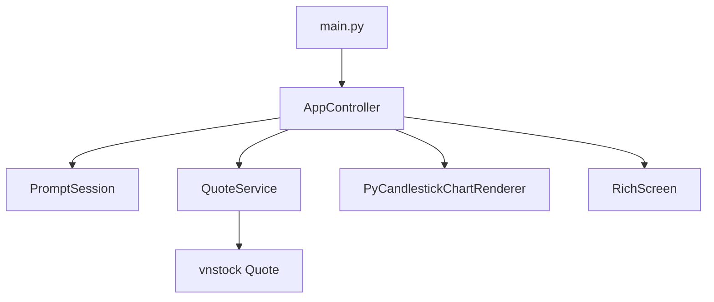

# vnbb

Interactive terminal candlestick explorer for `vnstock` market data. The app uses `questionary` for input, `rich` for layout and warnings, and `candlestick-chart` for terminal candlestick rendering.

## Features

- Historical-first TUI workflow for symbol, source, interval, and date range selection
- `candlestick-chart` rendering inside a Rich panel
- Clear runtime warnings when `vnstock` data fetches fail or required packages are missing
- Strict typed candle normalization shared by the charting flow

## Architecture



## Usage

Install dependencies and run the TUI:

```bash
uv sync
uv run python main.py
```

Prompt flow:

1. Enter a stock symbol such as `ACB`
2. Choose a data source such as `VCI` or `KBS`
3. Choose an interval such as `1D`
4. Enter `start` and `end` dates
5. Review the candlestick chart and either reconfigure or quit

Chart behavior:
The X-axis displays the requested historical window.
Only the records returned for the selected date range and interval are visualized.

## Warning Behavior

If `vnstock` cannot reach its upstream provider, the app stops and prints a clear warning with the provider error details. This is expected in offline or sandboxed environments and should be treated as an environment issue rather than a charting bug.

Source behavior:
This TUI is for Vietnamese stock candlestick charts, so it only offers `VCI` and `KBS`.
`MSN` in `vnstock` is intended for mapped forex, crypto, and world-index symbols rather than local stock tickers such as `ACB`.

## Scope Of Impact

- Entry flow changed from a single print statement to a full TUI controller loop
- New service and renderer layers centralize market data normalization and terminal chart rendering
- Packaging now declares runtime dependencies for terminal UI and charting
- Documentation now describes runtime behavior, warnings, and architecture

## Files And Functions

- [main.py](/Users/tamle/Projects/vnbb/main.py)
  `main()`
- [app/controller.py](/Users/tamle/Projects/vnbb/app/controller.py)
  `AppController.run()`
- [app/bootstrap.py](/Users/tamle/Projects/vnbb/app/bootstrap.py)
  `build_application()`
- [app/services/quote_service.py](/Users/tamle/Projects/vnbb/app/services/quote_service.py)
  `QuoteService.fetch_history()`
  `QuoteService._build_quote()`
  `QuoteService._normalize_history()`
- [app/renderers/candlestick_chart_renderer.py](/Users/tamle/Projects/vnbb/app/renderers/candlestick_chart_renderer.py)
  `PyCandlestickChartRenderer.render()`
- [app/ui/prompts.py](/Users/tamle/Projects/vnbb/app/ui/prompts.py)
  `PromptSession.collect_request()`
  `PromptSession.collect_next_action()`
  `PromptSession.show_error()`
  `PromptSession.show_info()`
- [app/ui/layout.py](/Users/tamle/Projects/vnbb/app/ui/layout.py)
  `RichScreen.terminal_size()`
  `RichScreen.show_chart()`
- [app/models/market_data.py](/Users/tamle/Projects/vnbb/app/models/market_data.py)
  `Candle.__post_init__()`

## Tests

```bash
pytest -q
```

Covered scenarios:

- candle validation
- OHLCV normalization and sorting
- candlestick renderer adaptation
- clear warning on upstream quote failure
- controller render loop

## Documentation Links

- vnstock skill reference: `/Users/tamle/.codex/skills/vnstock/SKILL.md`
- Rich docs: https://context7.com/textualize/rich/llms.txt
- Questionary docs: https://questionary.readthedocs.io/en/stable/
- Python Candlestick Chart repo: https://github.com/BoboTiG/py-candlestick-chart
